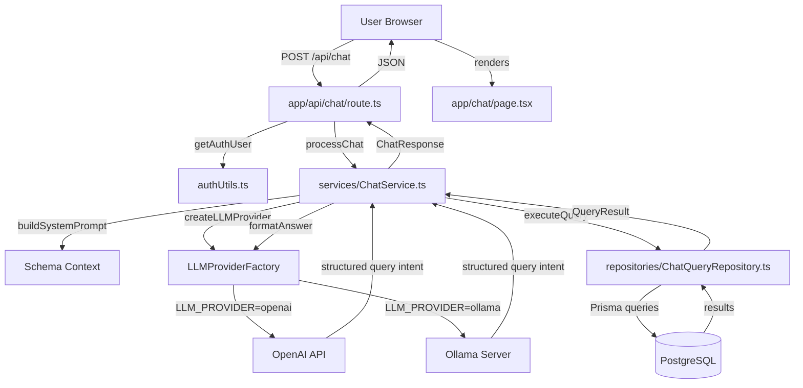
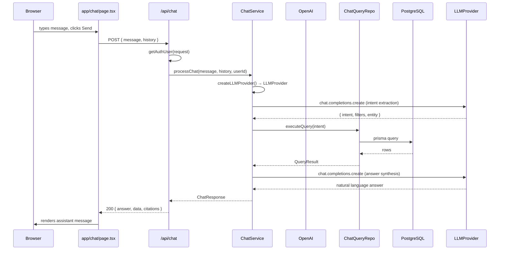
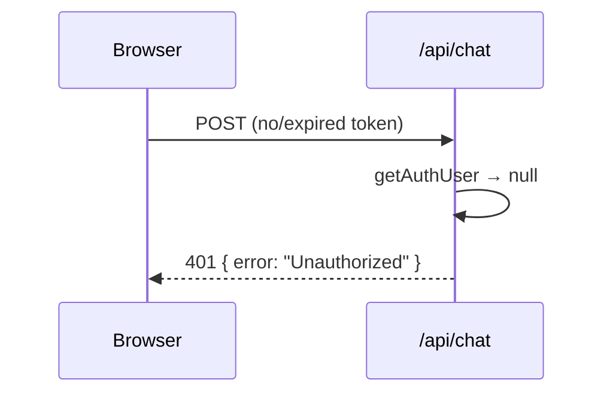

# Design Document: LLM Chat Interface

## Overview

This feature adds a natural-language chat interface to the Drug Development Dashboard that lets authenticated users query Programs, Studies, and Milestones using plain English. User messages are sent to a backend API route that uses an LLM (OpenAI) to interpret the intent, translate it into structured Prisma queries, execute them against the PostgreSQL database, and return a human-readable answer alongside the raw data.

The design follows the existing layered architecture: a new React chat page calls a new `/api/chat` route, which delegates to a `ChatService` that orchestrates the LLM and a new `ChatQueryRepository`. All existing auth patterns (JWT cookie, `getAuthUser`) are reused without modification.

## Architecture



## Sequence Diagrams

### Happy Path: User Sends a Query



### Auth Failure



## Components and Interfaces

### Component 1: Chat Page (`app/chat/page.tsx`)

**Purpose**: Client-side chat UI — message list, input box, send button, loading state.

**Interface**:
```typescript
// No exported interface; internal state only
interface Message {
  role: "user" | "assistant"
  content: string
  data?: QueryResult       // optional structured data to render as table
  timestamp: Date
}
```

**Responsibilities**:
- Render conversation history
- POST to `/api/chat` with current message and trimmed history (last 10 turns)
- Display loading indicator while awaiting response
- Render structured `data` payloads as sortable tables when present
- Respect auth state from `useAuth()` — redirect to `/login` if unauthenticated

---

### Component 2: Chat API Route (`app/api/chat/route.ts`)

**Purpose**: Authenticated Next.js route handler; entry point for all chat requests.

**Interface**:
```typescript
// POST /api/chat
interface ChatRequest {
  message: string                  // user's natural language query
  history?: ConversationTurn[]     // previous turns for context (max 10)
}

interface ChatResponse {
  answer: string                   // LLM-generated natural language answer
  data?: QueryResult               // structured DB results (optional)
  citations?: string[]             // entity names referenced in the answer
}

interface ConversationTurn {
  role: "user" | "assistant"
  content: string
}
```

**Responsibilities**:
- Validate JWT via `getAuthUser(request)`
- Validate and sanitize request body
- Delegate to `ChatService.processChat()`
- Return structured `ChatResponse` or error JSON

---

### Component 3: ChatService (`services/ChatService.ts`)

**Purpose**: Orchestrates the two-phase LLM interaction (intent extraction → answer synthesis) and query execution.

**Interface**:
```typescript
interface QueryIntent {
  entity: "Program" | "Study" | "Milestone" | "mixed"
  action: "list" | "count" | "detail" | "aggregate"
  filters: {
    phase?: string
    therapeuticArea?: string
    status?: string
    programId?: string
    dateRange?: { from?: string; to?: string }
    nameContains?: string
  }
  limit?: number
}

interface QueryResult {
  entity: string
  rows: Record<string, unknown>[]
  totalCount: number
}

// Main export
export async function processChat(
  message: string,
  history: ConversationTurn[],
  userId: string
): Promise<ChatResponse>
```

**Responsibilities**:
- Build a system prompt that includes the DB schema summary
- Call `createLLMProvider()` to obtain the configured LLM client
- Call the LLM to extract a `QueryIntent` from the user message (JSON mode)
- Call `ChatQueryRepository.executeQuery(intent)` to fetch data
- Call the LLM a second time to synthesize a natural language answer from the data
- Handle LLM errors gracefully (fallback answer, no crash)

---

### Component 4: LLM Provider Abstraction (`services/llm/`)

**Purpose**: Decouples `ChatService` from any specific LLM backend. A factory function reads `LLM_PROVIDER` from the environment and returns an OpenAI-SDK-compatible client pointed at the correct endpoint.

**Interface**:
```typescript
// services/llm/types.ts
type LLMProviderType = "openai" | "ollama"

interface LLMProviderConfig {
  provider: LLMProviderType
  // OpenAI
  openaiApiKey?: string
  // Ollama
  ollamaBaseUrl?: string   // e.g. "http://localhost:11434/v1"
  ollamaModel?: string     // e.g. "llama3", "mistral"
}

// services/llm/factory.ts
function createLLMProvider(config: LLMProviderConfig): OpenAI
// Returns an OpenAI SDK instance.
// For "openai": standard client with OPENAI_API_KEY.
// For "ollama": client with baseURL=ollamaBaseUrl and apiKey="ollama" (placeholder).
```

**Responsibilities**:
- Read `LLM_PROVIDER`, `OPENAI_API_KEY`, `OLLAMA_BASE_URL`, `OLLAMA_MODEL` from environment
- Return an `OpenAI` client instance configured for the selected provider
- Throw a descriptive startup error if required env vars for the chosen provider are missing
- `ChatService` calls `createLLMProvider()` once and uses the returned client — no provider-specific branching in `ChatService`

**Environment Variables**:

| Variable | Required for | Description |
|---|---|---|
| `LLM_PROVIDER` | always | `"openai"` (default) or `"ollama"` |
| `OPENAI_API_KEY` | `openai` | OpenAI secret key |
| `OLLAMA_BASE_URL` | `ollama` | Base URL of Ollama server, e.g. `http://localhost:11434/v1` |
| `OLLAMA_MODEL` | `ollama` | Model name, e.g. `"llama3"`, `"mistral"` |

**Why Ollama works with the OpenAI SDK**: Ollama exposes an OpenAI-compatible REST API at `/v1`. The same `openai` npm package is used for both providers — only `baseURL` and `apiKey` differ. The model name is passed as the `model` field in each completion request.

---

### Component 5: ChatQueryRepository (`repositories/ChatQueryRepository.ts`)

**Purpose**: Translates a `QueryIntent` into safe, parameterized Prisma queries.

**Interface**:
```typescript
export async function executeQuery(intent: QueryIntent): Promise<QueryResult>
```

**Responsibilities**:
- Map `intent.entity` and `intent.filters` to Prisma `where` clauses
- Never execute raw SQL — Prisma only
- Enforce a hard `take` cap of 50 rows to prevent runaway queries
- Return `QueryResult` with rows and total count

---

## Data Models

### ChatRequest / ChatResponse

```typescript
interface ChatRequest {
  message: string           // required, 1–2000 chars
  history?: ConversationTurn[]
}

interface ChatResponse {
  answer: string
  data?: QueryResult
  citations?: string[]
}

interface ConversationTurn {
  role: "user" | "assistant"
  content: string
}
```

**Validation Rules**:
- `message` must be non-empty and ≤ 2000 characters
- `history` array capped at 10 turns before being sent to the LLM
- No PII fields are stored server-side; history is ephemeral (client-only)

### QueryIntent

```typescript
interface QueryIntent {
  entity: "Program" | "Study" | "Milestone" | "mixed"
  action: "list" | "count" | "detail" | "aggregate"
  filters: QueryFilters
  limit?: number   // capped at 50 server-side regardless of LLM output
}

interface QueryFilters {
  phase?: string
  therapeuticArea?: string
  status?: string
  programId?: string
  nameContains?: string
  dateRange?: { from?: string; to?: string }
}
```

### QueryResult

```typescript
interface QueryResult {
  entity: string
  rows: Record<string, unknown>[]
  totalCount: number
}
```

---

## Algorithmic Pseudocode

### Main Processing Algorithm: `processChat`

```typescript
async function processChat(
  message: string,
  history: ConversationTurn[],
  userId: string
): Promise<ChatResponse>
```

**Preconditions:**
- `message` is non-empty string, length ≤ 2000
- `history` contains at most 10 prior turns
- `userId` is a valid authenticated user ID

**Postconditions:**
- Returns a `ChatResponse` with a non-empty `answer`
- If DB data was fetched, `data` field is populated
- Never throws — errors produce a graceful fallback answer

**Algorithm:**

```typescript
ALGORITHM processChat(message, history, userId)
INPUT: message: string, history: ConversationTurn[], userId: string
OUTPUT: response: ChatResponse

BEGIN
  // Resolve LLM provider from environment
  llm    ← createLLMProvider()
  model  ← process.env.LLM_PROVIDER = "ollama"
             ? (process.env.OLLAMA_MODEL ?? "llama3")
             : "gpt-4o-mini"

  // Phase 1: Intent Extraction
  systemPrompt ← buildSystemPrompt(DB_SCHEMA_SUMMARY)
  intentMessages ← [
    { role: "system", content: systemPrompt },
    ...history.slice(-10),
    { role: "user", content: message }
  ]

  intentRaw ← await llm.chat.completions.create({
    model,
    response_format: { type: "json_object" },
    messages: intentMessages
  })

  intent ← JSON.parse(intentRaw.choices[0].message.content) as QueryIntent
  intent.limit ← Math.min(intent.limit ?? 20, 50)   // enforce cap

  // Phase 2: Query Execution
  queryResult ← await executeQuery(intent)

  // Phase 3: Answer Synthesis
  synthesisMessages ← [
    { role: "system", content: SYNTHESIS_SYSTEM_PROMPT },
    { role: "user", content: message },
    { role: "assistant", content: JSON.stringify(queryResult) }
  ]

  answerRaw ← await llm.chat.completions.create({
    model,
    messages: synthesisMessages
  })

  answer ← answerRaw.choices[0].message.content

  RETURN {
    answer,
    data: queryResult.rows.length > 0 ? queryResult : undefined,
    citations: extractEntityNames(queryResult.rows)
  }
END
```

**Loop Invariants:** N/A (no loops in main flow)

---

### Query Execution Algorithm: `executeQuery`

```typescript
async function executeQuery(intent: QueryIntent): Promise<QueryResult>
```

**Preconditions:**
- `intent.entity` is one of the known enum values
- `intent.filters` contains only safe, typed values (no raw SQL)
- `intent.limit` ≤ 50

**Postconditions:**
- Returns `QueryResult` with `rows` array (may be empty) and `totalCount`
- No mutations to the database

**Algorithm:**

```typescript
ALGORITHM executeQuery(intent)
INPUT: intent: QueryIntent
OUTPUT: result: QueryResult

BEGIN
  where ← buildWhereClause(intent.filters, intent.entity)
  take  ← Math.min(intent.limit ?? 20, 50)

  IF intent.entity = "Program" THEN
    rows ← await prisma.program.findMany({
      where,
      include: { studies: true, milestones: true },
      take
    })
    total ← await prisma.program.count({ where })

  ELSE IF intent.entity = "Study" THEN
    rows ← await prisma.study.findMany({ where, take })
    total ← await prisma.study.count({ where })

  ELSE IF intent.entity = "Milestone" THEN
    rows ← await prisma.milestone.findMany({ where, take })
    total ← await prisma.milestone.count({ where })

  ELSE  // "mixed" — query all three, merge
    programs  ← await prisma.program.findMany({ where: {}, take: 10 })
    studies   ← await prisma.study.findMany({ where: {}, take: 10 })
    milestones ← await prisma.milestone.findMany({ where: {}, take: 10 })
    rows  ← [...programs, ...studies, ...milestones]
    total ← rows.length
  END IF

  RETURN { entity: intent.entity, rows, totalCount: total }
END
```

**Loop Invariants:** N/A

---

### Where Clause Builder: `buildWhereClause`

```typescript
function buildWhereClause(
  filters: QueryFilters,
  entity: QueryIntent["entity"]
): Record<string, unknown>
```

**Preconditions:**
- `filters` is a plain object with only typed, optional fields
- `entity` is a known enum value

**Postconditions:**
- Returns a valid Prisma `where` object
- Only defined filter values are included (no `undefined` keys)
- No raw SQL injected

**Algorithm:**

```typescript
ALGORITHM buildWhereClause(filters, entity)
INPUT: filters: QueryFilters, entity: string
OUTPUT: where: Record<string, unknown>

BEGIN
  where ← {}

  IF filters.phase IS DEFINED THEN
    where.phase ← { contains: filters.phase, mode: "insensitive" }
  END IF

  IF filters.therapeuticArea IS DEFINED AND entity = "Program" THEN
    where.therapeuticArea ← { contains: filters.therapeuticArea, mode: "insensitive" }
  END IF

  IF filters.status IS DEFINED THEN
    where.status ← { contains: filters.status, mode: "insensitive" }
  END IF

  IF filters.nameContains IS DEFINED THEN
    where.name ← { contains: filters.nameContains, mode: "insensitive" }
  END IF

  IF filters.programId IS DEFINED AND entity ≠ "Program" THEN
    where.programId ← filters.programId
  END IF

  IF filters.dateRange IS DEFINED AND entity = "Milestone" THEN
    where.targetDate ← {
      gte: filters.dateRange.from ? new Date(filters.dateRange.from) : undefined,
      lte: filters.dateRange.to   ? new Date(filters.dateRange.to)   : undefined
    }
  END IF

  RETURN where
END
```

**Loop Invariants:** N/A

---

## Key Functions with Formal Specifications

### `createLLMProvider(): OpenAI`

**Preconditions:**
- `LLM_PROVIDER` is either `"openai"` or `"ollama"` (defaults to `"openai"` if unset)
- If `LLM_PROVIDER = "openai"`: `OPENAI_API_KEY` is a non-empty string
- If `LLM_PROVIDER = "ollama"`: `OLLAMA_BASE_URL` is a non-empty, valid URL

**Postconditions:**
- Returns an `OpenAI` SDK instance configured for the selected provider
- For `"ollama"`: `baseURL` is set to `OLLAMA_BASE_URL`, `apiKey` is set to `"ollama"` (required by SDK but unused by Ollama)
- Throws a descriptive `Error` at startup if required env vars are missing, preventing silent misconfiguration

---

### `buildSystemPrompt(schemaSummary: string): string`

**Preconditions:**
- `schemaSummary` is a non-empty string describing the DB schema

**Postconditions:**
- Returns a system prompt string that instructs the LLM to output valid JSON matching `QueryIntent`
- Prompt includes field names, types, and example values for all three models

---

### `extractEntityNames(rows: Record<string, unknown>[]): string[]`

**Preconditions:**
- `rows` is an array (may be empty)

**Postconditions:**
- Returns an array of unique `name` or `title` string values found in rows
- Returns `[]` if rows is empty or no name/title fields exist

---

## Example Usage

```typescript
// API route handler
export async function POST(req: NextRequest) {
  const user = await getAuthUser(req)
  if (!user) return NextResponse.json({ error: "Unauthorized" }, { status: 401 })

  const { message, history } = await req.json()
  if (!message || message.length > 2000) {
    return NextResponse.json({ error: "Invalid message" }, { status: 400 })
  }

  const response = await processChat(message, history ?? [], user.id)
  return NextResponse.json(response)
}

// Client-side usage
const res = await fetch("/api/chat", {
  method: "POST",
  headers: { "Content-Type": "application/json" },
  body: JSON.stringify({
    message: "Show me all Phase II programs in Cardiology",
    history: conversationHistory.slice(-10)
  })
})
const { answer, data } = await res.json()
// answer: "There are 3 Phase II Cardiology programs: ..."
// data: { entity: "Program", rows: [...], totalCount: 3 }
```

---

## Correctness Properties

*A property is a characteristic or behavior that should hold true across all valid executions of a system — essentially, a formal statement about what the system should do. Properties serve as the bridge between human-readable specifications and machine-verifiable correctness guarantees.*

### Property 1: Unauthenticated requests always yield 401

*For any* HTTP request to `POST /api/chat` that does not carry a valid JWT, the response status code is always 401 and the body contains `{ "error": "Unauthorized" }`.

**Validates: Requirements 2.1**

---

### Property 2: Authenticated requests with valid messages always yield a non-empty answer

*For any* authenticated request with a non-empty `message` of at most 2000 characters, the API returns HTTP 200 with a `ChatResponse` whose `answer` field is a non-empty string.

**Validates: Requirements 2.2, 4.1, 4.2, 4.3, 11.1**

---

### Property 3: Message length validation boundary

*For any* string whose length exceeds 2000 characters, submitting it as the `message` field always produces HTTP 400 before any LLM call is made.

**Validates: Requirements 3.2, 13.3**

---

### Property 4: Empty and absent messages are rejected

*For any* request body where `message` is the empty string or is absent, the API always returns HTTP 400.

**Validates: Requirements 3.1**

---

### Property 5: Non-JSON request bodies are rejected

*For any* request body that cannot be parsed as JSON, the API always returns HTTP 400.

**Validates: Requirements 3.4**

---

### Property 6: History is always capped at 10 turns before LLM call

*For any* conversation history array of arbitrary length, the number of `ConversationTurn` entries included in the LLM intent extraction prompt is always at most 10.

**Validates: Requirements 1.6, 4.6, 12.2**

---

### Property 7: Row cap is always enforced at 50

*For any* `QueryIntent` with any `limit` value (including values greater than 50 or very large numbers), `ChatQueryRepository.executeQuery()` always calls Prisma with `take ≤ 50`.

**Validates: Requirements 4.5, 8.3**

---

### Property 8: buildWhereClause produces only defined, typed filter fields

*For any* `QueryFilters` object, `buildWhereClause` produces a Prisma `where` clause that (a) contains no key with value `undefined`, (b) maps each defined filter to the correct Prisma operator (`contains` with `mode: "insensitive"` for string fields, exact match for `programId`, `gte`/`lte` for `dateRange`), and (c) includes no keys that are not present in the known `QueryFilters` type.

**Validates: Requirements 9.1, 9.2, 9.3, 9.4, 9.5, 9.6, 9.7, 13.2**

---

### Property 9: LLM JSON parse failure never produces HTTP 500

*For any* malformed or non-JSON string returned by the LLM during intent extraction, `processChat` catches the error and returns a valid `ChatResponse` (HTTP 200) rather than propagating a 500.

**Validates: Requirements 5.1, 5.2, 5.3**

---

### Property 10: LLM network errors always produce HTTP 503

*For any* network or rate-limit error thrown by the `LLMProvider` client during any LLM call, the API returns HTTP 503 with `{ "error": "AI service temporarily unavailable" }`.

**Validates: Requirements 6.1**

---

### Property 11: QueryResult always has the required shape

*For any* valid `QueryIntent`, `ChatQueryRepository.executeQuery()` always returns an object with an `entity` string, a `rows` array (which may be empty), and a numeric `totalCount`.

**Validates: Requirements 8.4**

---

### Property 12: data field presence matches row count

*For any* `ChatResponse`, the `data` field is present if and only if the underlying `QueryResult.rows` array is non-empty.

**Validates: Requirements 11.2, 11.3**

---

### Property 13: citations contains only unique strings

*For any* array of result rows, `extractEntityNames` returns an array of unique strings (no duplicates), and returns an empty array when rows is empty or no `name`/`title` fields exist.

**Validates: Requirements 4.7, 11.4**

---

### Property 14: LLMProviderFactory returns an OpenAI-SDK-compatible client for all valid providers

*For any* valid value of `LLM_PROVIDER` (`"openai"` or `"ollama"`) with the corresponding required env vars present, `createLLMProvider()` returns an object that is an instance of the OpenAI SDK client and is callable with `chat.completions.create`.

**Validates: Requirements 7.1, 7.8**

---

### Property 15: Sensitive env vars never appear in HTTP responses

*For any* HTTP response from `POST /api/chat`, the response body string does not contain the value of `OPENAI_API_KEY` or `OLLAMA_BASE_URL`.

**Validates: Requirements 13.1**

---

## Error Handling

### Provider Misconfiguration

**Condition**: `LLM_PROVIDER` is set to `"ollama"` but `OLLAMA_BASE_URL` is missing (or vice versa for `openai`/`OPENAI_API_KEY`)
**Response**: `createLLMProvider()` throws a descriptive `Error` at server startup, preventing the app from starting in a broken state
**Recovery**: Operator adds the missing env var and restarts the service

### LLM JSON Parse Failure

**Condition**: The LLM returns non-JSON or JSON that doesn't match `QueryIntent`
**Response**: Catch parse error, fall back to a broad `list` query on `Program`, synthesize answer from that
**Recovery**: User sees a valid (if generic) answer; no 500 error

### OpenAI API Unavailable / Rate Limited

**Condition**: The LLM SDK throws a network or rate-limit error (applies to both OpenAI and Ollama)
**Response**: Return HTTP 503 with `{ error: "AI service temporarily unavailable" }`
**Recovery**: Client displays a user-friendly retry message

### Empty Query Results

**Condition**: Prisma returns zero rows for the extracted intent
**Response**: `QueryResult.rows = []`, LLM synthesizes "No results found" answer
**Recovery**: User sees a clear "no data" message, not an error

### Message Too Long

**Condition**: `message.length > 2000`
**Response**: Return HTTP 400 with `{ error: "Message too long" }` before calling LLM
**Recovery**: Client shows inline validation error

---

## Testing Strategy

### Unit Testing Approach

- `buildWhereClause`: test all filter combinations, verify no undefined keys leak into output
- `extractEntityNames`: test empty rows, rows with `name`, rows with `title`, mixed
- `createLLMProvider`: test that `"openai"` returns a standard client, `"ollama"` returns a client with the correct `baseURL`, and missing required env vars throw
- `ChatService.processChat`: mock the LLM provider client, verify intent extraction and answer synthesis calls
- `ChatQueryRepository.executeQuery`: mock Prisma client, verify correct model is queried per entity type and `take` cap is enforced

### Property-Based Testing Approach

**Property Test Library**: fast-check

- For any `QueryFilters` object, `buildWhereClause` never produces a key with value `undefined`
- For any `intent.limit` value (including very large numbers), `executeQuery` always calls Prisma with `take ≤ 50`
- For any array of rows, `extractEntityNames` returns only unique strings

### Integration Testing Approach

- POST `/api/chat` without auth token → 401
- POST `/api/chat` with valid token and `message: "list all programs"` → 200 with `answer` string
- POST `/api/chat` with `message` of 2001 chars → 400

---

## Performance Considerations

- LLM calls are the dominant latency source (~500ms–2s for OpenAI; local Ollama latency depends on hardware but avoids network round-trips). The two-phase approach (intent + synthesis) adds two round trips; this is acceptable for a chat UX where users expect slight delays.
- Prisma queries are bounded to 50 rows, preventing large result sets from bloating the synthesis prompt.
- Conversation history is trimmed to 10 turns client-side before sending, keeping token usage predictable.
- The `OPENAI_API_KEY` is server-side only; it is never exposed to the browser.

## Security Considerations

- All requests require a valid JWT (existing `getAuthUser` pattern) — no anonymous access.
- The LLM output is used only to build a typed `QueryIntent` struct; it never directly interpolates into SQL or Prisma raw queries.
- `buildWhereClause` only maps known, typed filter fields — arbitrary LLM-generated keys are ignored.
- `message` length is validated server-side (≤ 2000 chars) to prevent prompt injection via oversized inputs.
- The `OPENAI_API_KEY` environment variable must be added to `.env.local` and never committed.
- `OLLAMA_BASE_URL` must point to an internal/private network address (e.g., `http://localhost:11434/v1` or a Docker-internal hostname). It must never be a public internet endpoint, as Ollama has no built-in authentication.
- Role-based access: all authenticated roles (VIEWER, EDITOR, ADMIN) may use the chat; it is read-only.

## Docker Compose: Ollama Service

The `docker-compose.yaml` includes an `ollama` service so the local LLM can be deployed and maintained alongside the project:

```yaml
ollama:
  image: ollama/ollama:latest
  restart: unless-stopped
  ports:
    - "11434:11434"
  volumes:
    - ollama_data:/root/.ollama
  # To pull a model on first run:
  #   docker compose exec ollama ollama pull llama3
```

After starting the stack with `docker compose up`, pull a model once:

```bash
docker compose exec ollama ollama pull llama3
```

Then set in `.env.local`:

```
LLM_PROVIDER=ollama
OLLAMA_BASE_URL=http://localhost:11434/v1
OLLAMA_MODEL=llama3
```

---

## Dependencies

- `openai` npm package (`openai` ^4.x) — OpenAI Node.js SDK; used for both OpenAI and Ollama (via compatible API)
- Environment variables (configure one provider):
  - `LLM_PROVIDER`: `"openai"` | `"ollama"` (default: `"openai"`)
  - `OPENAI_API_KEY`: required when `LLM_PROVIDER=openai`
  - `OLLAMA_BASE_URL`: required when `LLM_PROVIDER=ollama` (e.g. `http://localhost:11434/v1`)
  - `OLLAMA_MODEL`: model name for Ollama (e.g. `"llama3"`, `"mistral"`)
- Ollama (optional, self-hosted): https://ollama.com — run locally or via Docker; see `docker-compose.yaml` for the service definition
- Existing: `@prisma/client`, `jsonwebtoken`, Next.js App Router, `app/lib/authUtils.ts`
